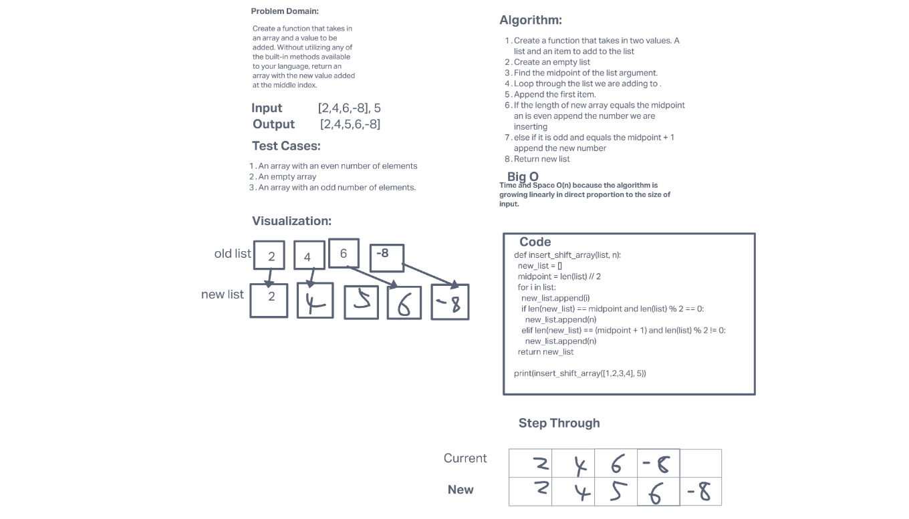

# Insert to Middle of an Array

Write a function called insertShiftArray which takes in an array and a value to be added. Without utilizing any of the built-in methods available to your language, return an array with the new value added at the middle index.

## Whiteboard Process

## Approach & Efficiency

The approach taken was to find the length of the existing array, then divide it by 2, then use a for loop to append each element of the existing array into a new array until the midpoint was reached. When the midpoint was reached, if the number of elements was even, the new number was inserted. If the midpoint was odd, one more element of the existing array was appended prior to the insertion of the new number. The for loop then continued to append the remaining elements of the existing array.

Time and Space O(n) because the algorithm is growing linearly in direct proportion to the size of input.

