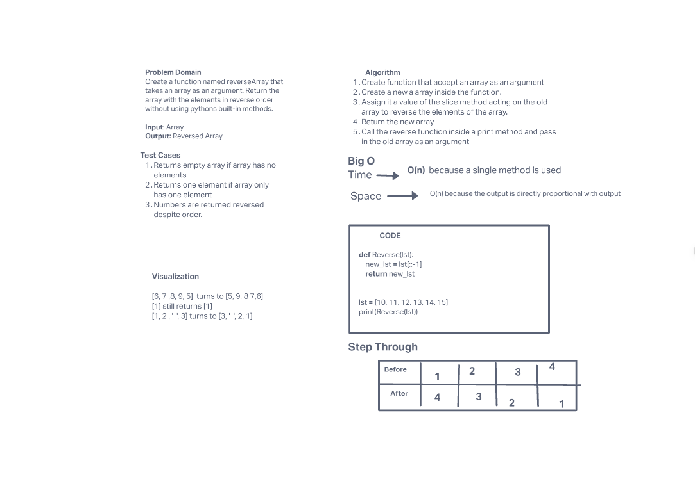

# Reverse an Array

Write a function called reverseArray which takes an array as an argument. Without utilizing any of the built-in methods available to your language, return an array with elements in reversed order.

## Whiteboard Process

## Approach & Efficiency

The approach I took was to use the slice method. I took this approach because it would iterate through every element in the array from the last one to the first one and make a new array.

Big O: Space - O(n) because there is a 1:1 ratio of the size of the input
with the output.
Time - O(n) because I used the slice method which is dependent on the number of elements in the array.
