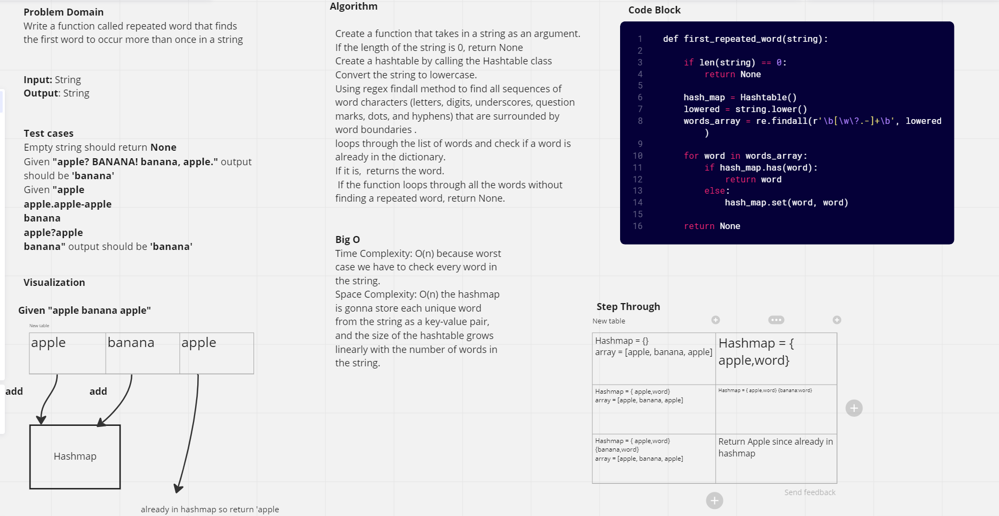

# Challenge Summary

Write a function called repeated word that finds the first word to occur more than once in a string

## Whiteboard Process

## Approach & Efficiency

Check if the length of the string is 0, if so return None. Create a Hashtable. Covert the string to lowercase. Use regex findall method to get all the words in the string including those with punctuations inside them. loops through the list of words and check if a word is already in the hashtable.
If it is,  returns the word.
 If the function loops through all the words without finding a repeated word, return None.

Time Complexity: O(n) because worst case we have to check every word in the string.

Space Complexity: O(n) the hashmap is going to store each unique word from the string as a key-value pair, and the size of the hashtable grows linearly with the number of words in the string.

## Solution

[Link To Code](/python/code_challenges/hashtable_repeated_word.py)

[Link To Test](/python/tests/code_challenges/test_hashtable_repeated_word.py)

