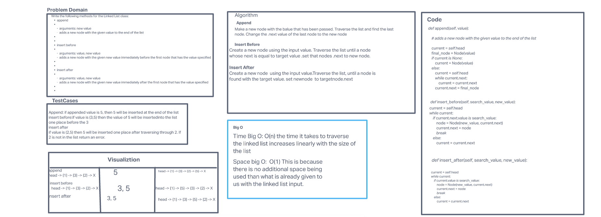

# Challenge Summary

Write the following methods for the Linked List class:

* **append**
arguments: new value
adds a new node with the given value to the end of the list
* **insert before**
arguments: value, new value
adds a new node with the given new value immediately before the first node that has the value specified
* **insert after**
arguments: value, new value
adds a new node with the given new value immediately after the first node that has the value specified

## Whiteboard Process



## Approach & Efficiency

`append`, `insert_before`, and `insert_after` methods:
* Time Big O: O(n): The time it takes to traverse the linked list increases linearly with the size of the list.
* Space big O: O(1): The script is making only one object and appending it to a linked list that already exists, so no matter the input, this takes the same amount of memory.


## Solution

```
linked_list = head -> (2) -> (3) -> (4) -> None

linked_list.append(5)

output head -> (2) -> (3) -> (4) -> (5) None

linked_list.insert_before(4, 1)

output head -> (2) -> (3) -> (1) -> (4) -> (5) None

linked_list.insert_after(3, 6)

output head -> (2) -> (3) -> (6) -> (1) -> (4) -> (5) None
```

[Link to code](/python/data_structures/linked_list.py)
