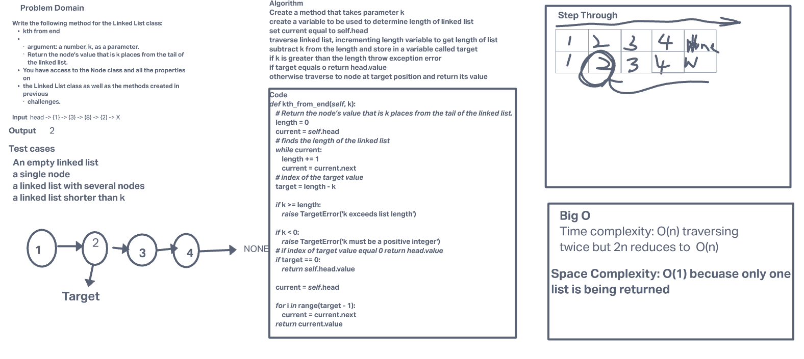

# Challenge Summary

Write the following method for the Linked List class:

kth from end
    * argument: a number, k, as a parameter.
    * Return the node’s value that is k places from the tail of the linked list.
    * You have access to the Node class and all the properties on the Linked List class as well as the methods created in previous challenges.

## Whiteboard Process

## Approach & Efficiency

I used this method because you cant use len on a linked list.

Create a method that takes parameter k

create a variable to be used to determine length of linked list

set current equal to self.head

traverse linked list, incrementing length variable to get length of list

subtract k from the length and store in a variable called target

if k is greater than the length throw exception error

if target equals o return head.value

otherwise traverse to node at target position and return its value

Time Big 0: O(n) because traversing twice and 2n reduces to O(n)

Space Big O: O(1) because we are only storing a few variables not related to input size.

