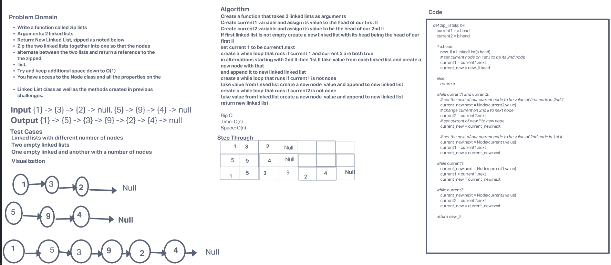

# Challenge Summary

Write a function called zip lists

Arguments: 2 linked lists

Return: New Linked List, zipped as noted below

Zip the two linked lists together into one so that the nodes alternate between the two lists and return a reference to the the zipped list.

Try and keep additional space down to O(1)
You have access to the Node class and all the properties on the Linked List class as well as the methods created in previous challenges.

## Whiteboard Process



## Approach & Efficiency

Created a pointer for each current of each of our two linked lists. I then created a new linked list and set its head to be the head of our first linked list. I then set current of our first linked list to be its next node value. I then set a while loop to alternatively each linked list while appending to our new linked list.

Big O:
Time O(n) time taken increases linearly with size of input
Space O(n) space increases linearly with size of input

## Solution

```

linked_list1 = (1) -> (2) -> (3) -> (4) -> None
linked_list2 = (5) -> (6) -> (7) -> (8) -> None

zip_lists(linked_list1, linked_list2)

output # (1) -> (5) -> (2) -> (6) -> (3) -> (7) -> (4) -> (8) -> None

```

[Link to code](/python/code_challenges/linked_list_zip.py)
