# Blog Notes: Insertion Sort

Insertion sort is a simple sorting algorithm that works similar to the way you sort playing cards in your hands. The array is virtually split into a sorted and an unsorted part. Values from the unsorted part are picked and placed at the correct position in the sorted part.

With a time complexity of O(n^2), it is not efficient for large arrays. However, it can be used for small sorting problems, where it often outperforms other O(n^2) algorithms in practice [Source]. This may be because nearly sorted lists can be quickly sorted with insertion sort.

## Pseudocode

  InsertionSort(int[] arr)

    FOR i = 1 to arr.length

      int j <-- i - 1
      int temp <-- arr[i]

      WHILE j >= 0 AND temp < arr[j]
        arr[j + 1] <-- arr[j]
        j <-- j - 1

      arr[j + 1] <-- temp

Declare a function that accepts a python list of numbers to be sorted and stored in variable list.

The variable i keeps track of the current index while iterating over the

Make one pass through the list of numbers using a for loop.

Make sure the for loop starts at position 1 not position 0 since the algorithm must always compare the current value with previous values.

Every time the index i is updated by the for loop, the current value at index i gets stored in a variable called temp. A second index, j, is defined to keep track of the values that will be compared to the value currently stored in temp. Notice that j is always initialized to start one place behind (to the left of) the current index i.

We then use a while loop to look at the values to the left of value at index i, until a value is reached which is smaller than the current temp value. The while loop is controlled by the second index, j, which starts one place to the left of i, and continues to move left (one element at a time) until it either reaches the first index 0, or until the value at j is smaller than the value at i, which is stored in temp.

Each time before the index j is updated inside our while loop, we set arr at index j to be the next value.  The list element currently at position j first gets copied to position j + 1. Why? This has the effect of shifting each element over one place to the right, so that when a value is found that is less than temp, rather than again shifting the current j value one place to the right, there is an open spot for the current temp value to be inserted (hence the name “insertion sort”). This is also why the value at i needed to first be stored in temp.

If a value is already correctly sorted (i.e., the value to its left is smaller), the while loop does not run, no shifting happens, and the for loop simply increments the index i and stores a new value in temp.

**Visual Representation**

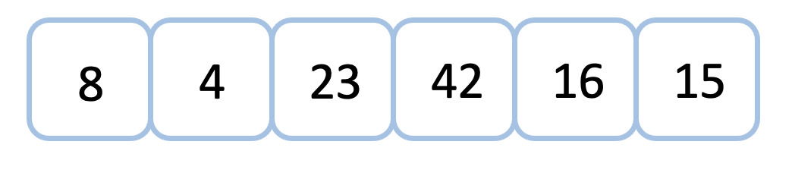
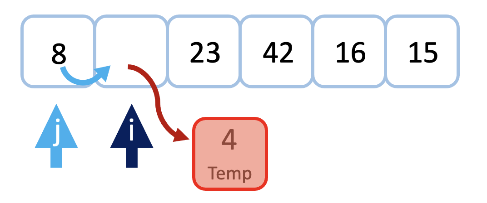
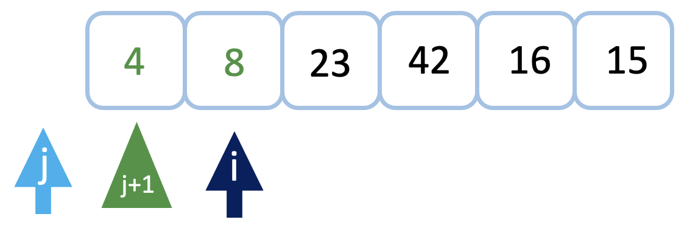
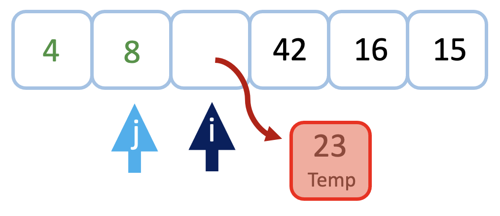
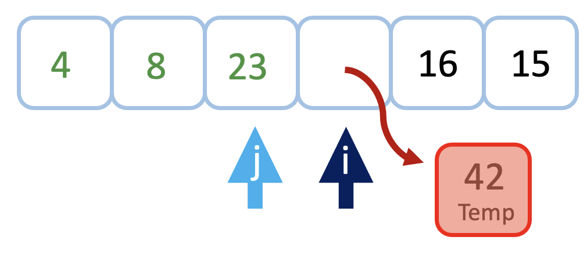
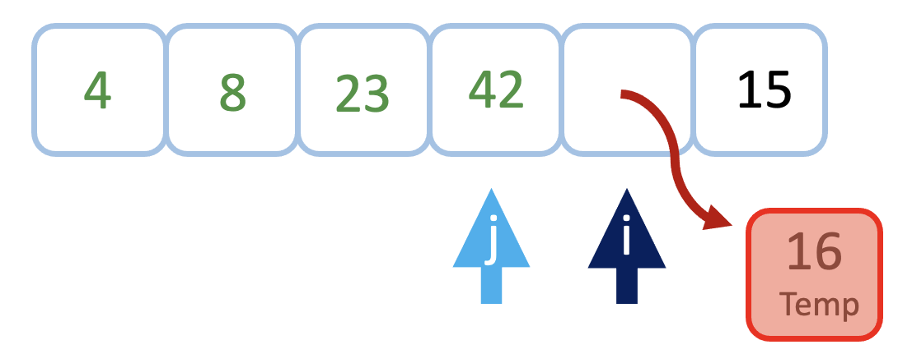
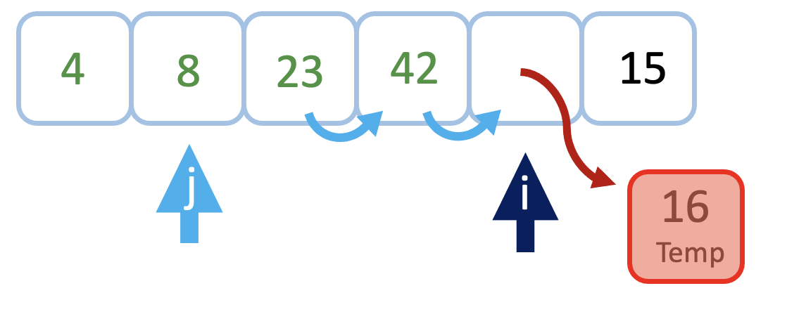
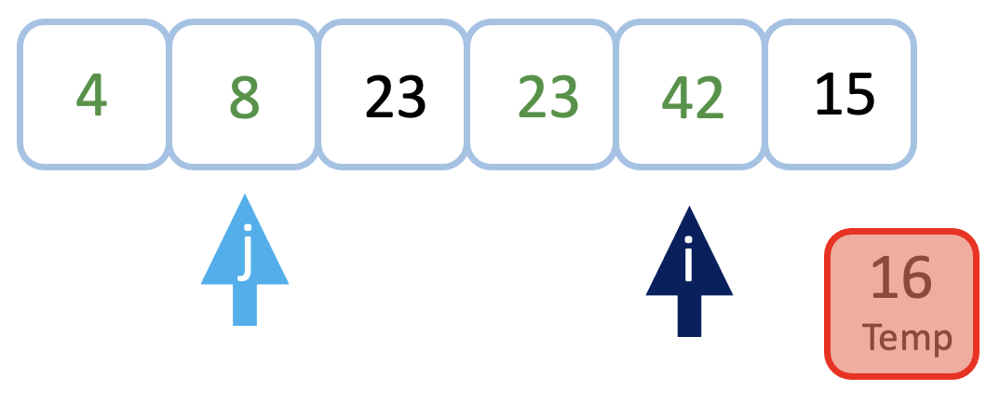
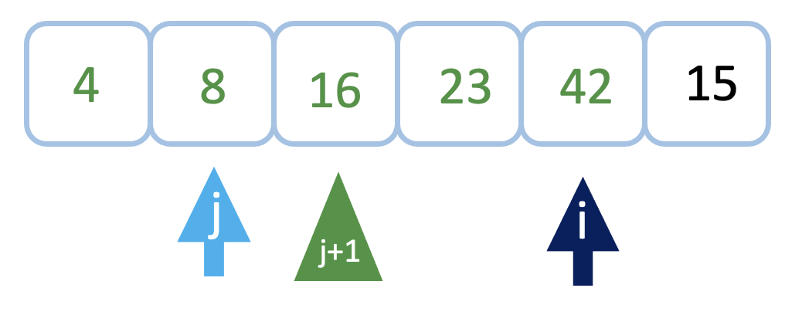
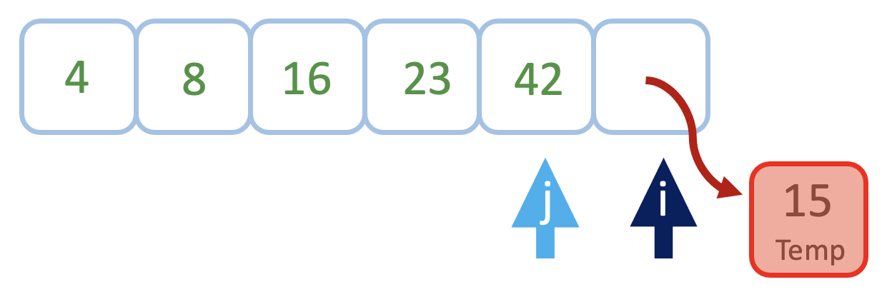
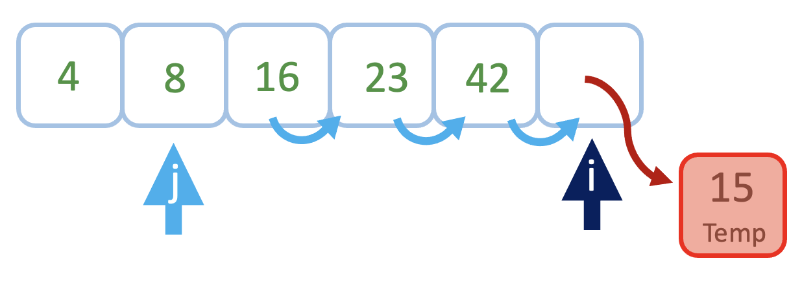
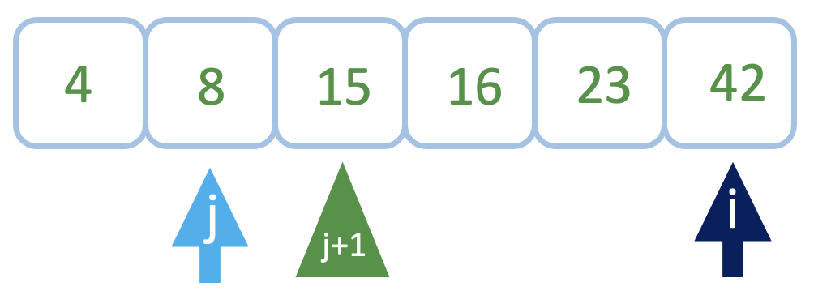

[Link to Code](/python/code_challenges/insertion_sort.py)

[Link to tests](/python/tests/code_challenges/test_insertion_sort.py)
