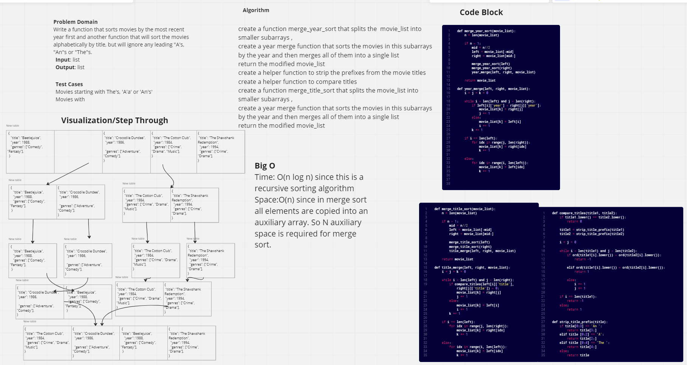

# Challenge Summary

Write a function that sorts movies by the most recent year first and another function that will sort the movies alphabetically by title, but will ignore any leading "A's, "An"s or "The"s.

## Whiteboard Process

## Approach & Efficiency

The approach I took for sorting the movies by most recent year was dividing the movie list into smaller lists, sorting each list by the `value` of the key `year`, and then merging the sorted list back together to form the final sorted listed.

The approach I took for sorting the movies alphabetically was first creating two helper functions. The first one `strip title prefix` removes the prefixes to be ignored from the title. The second one compares the `title strings`. We then divide the movie list into smaller lists, sorting each list by the `value` of the key `title`, and then merging the sorted list back together to form the final sorted listed...

Big O:

Time: O(n log n) since this is a recursive sorting algorithm

Space: O(n) since in merge sort all elements are copied into an auxiliary array. So N auxiliary space is required for merge sort.

## Solution

[Link to Code](/python/code_challenges/merge_sort.py)
[Link to Test](/python/tests/code_challenges/test_movie_sort.py)
